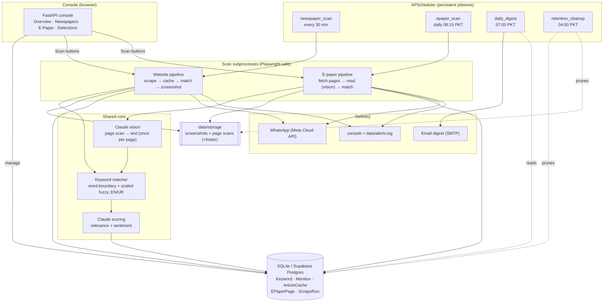

# Architecture

Media Monitoring watches Pakistani newspapers — their **websites** and their
daily **e-paper print editions** — for keywords, captures evidence (screenshots
/ page scans), scores relevance and sentiment, sends real-time alerts, and
emails a daily digest.

## System diagram

## Components

| Area | Path | Responsibility |
|------|------|----------------|
| Config | `config.py` | All settings from env (`pydantic-settings`); nothing hardcoded |
| Database | `app/db/` | SQLAlchemy models + engine (SQLite or Supabase Postgres) |
| Core | `app/core/keywords.py` | Word-boundary matching + length-scaled fuzzy, EN/UR normalization |
| Core | `app/core/scoring.py` | Claude relevance/sentiment (config-gated) |
| Websites | `app/scrapers/` | `base` (Playwright + robots + screenshots + footer), `dawn`, `configurable` + `sites.py` registry |
| Websites | `app/newspaper/` | `pipeline` (scrape→cache→match→screenshot→store→alert), `scan_manager` (subprocess runner) |
| E-paper | `app/epaper/` | `sources` (per-paper page-scan adapters), `reader` (Claude vision page→text), `pipeline` (fetch→read→match→alert), `scan_runner` (subprocess) |
| Notifiers | `app/notifiers/` | `console`, `whatsapp` (dry-run without creds), `MultiNotifier` |
| Digest | `app/digest/` | 24h HTML digest builder + SMTP sender (file fallback) |
| Maintenance | `app/maintenance/retention.py` | Prune screenshots/cached text/logs past retention |
| Scheduler | `app/scheduler.py` | APScheduler jobs, persistent jobstore (resume after restart) |
| Web app | `app/main.py` | FastAPI console + JSON API + scheduler lifecycle |
| Scripts | `scripts/` | CLI entry points (also what the subprocess runners invoke) |
| Tests | `tests/test_keywords.py` | keyword-matching precision suite (`python -m tests.test_keywords`) |

## E-paper coverage (print editions)

| Paper | Language | Source pattern |
|---|---|---|
| Dawn | EN | `e.dawn.com/{Y}/{m}/{d}/pages/{d_m_Y}_{NNN}.jpg` (probed) |
| Express Tribune | EN | `tribune.com.pk/epaper` listing → `i.tribune.com.pk/...` full-size |
| The News | EN | `e.thenews.pk/static_pages/{m-d-Y}/{city}/mainpage/pageN.jpg` (probed) |
| Jang | UR | `e.jang.com.pk/static_pages/{m-d-Y}/{city}/mainpage/pageN.jpg` (probed) |
| Express Urdu | UR | `express.com.pk/epaper/Index.aspx?Issue=NP_{CITY}` listing |
| Nawa-i-Waqt | UR | `/E-Paper/{city}/{date}/page-1` viewer → `epaper_image/large/...` |

Not fetchable: **Dunya** (e-paper host has a broken TLS certificate), **ARY /
Geo** (TV channels — no print edition). Pages upload progressively through the
morning, so adapters probe every page number up to `EPAPER_MAX_PAGES` and keep
what exists; the next scheduled cycle picks up late pages.

**Reading & clipping — two paths, best first:**

1. **Image-map (Jang, The News)** — `app/epaper/imagemap.py`. These platforms
   ship an HTML `<area>` map: one region per article, whose polygon is the
   article's exact box (in the same pixel space as the page scan we download)
   and whose link points at a detail page with clean article text. So we skip
   OCR/vision entirely: store per-article regions + text (`EPaperPage.regions`,
   `ocr_text`), match keywords on the clean text, and cut the matched article by
   cropping its exact polygon. Pure httpx — no LLM, no key, no rate limit,
   pixel-perfect cutouts.
2. **Vision (Dawn, Express, and any paper without a usable map)** —
   `app/epaper/reader.py` sends each page once to a vision model (Groq Llama-4,
   or Claude) and caches the text on `EPaperPage.ocr_text`; `app/epaper/clip.py`
   then locates + verifies a crop (grid method for weak models; native boxes
   with Gemini). Without any vision key, pages are still fetched and browsable
   (`ocr_status='no_key'`) and read once a key appears.

Both paths feed the same matcher and produce the same detections; a clip falls
back to the stamped full page if neither method yields a confident crop.

## Key design decisions (diverge from the original brief — intentional, for a local Windows build)

| Brief recommended | Built | Why | How to switch later |
|---|---|---|---|
| Docker | none (local) | requested "no Docker" | add Dockerfile/compose |
| PostgreSQL + pgvector | SQLAlchemy (SQLite or Supabase) | zero-setup on Windows; Supabase in prod | already done via `DATABASE_URL` |
| Celery + Redis | APScheduler | Celery unsupported on Windows; no broker | move `scripts/run_*` into Celery tasks |
| AWS SES | SMTP | universal (Gmail/SES-SMTP/etc.) | keep SMTP or swap to SES SDK |
| AWS S3 / R2 | local `data/storage` | no cloud dep locally | add an S3 upload step |
| React + Tailwind | server-rendered HTML | fewer moving parts for MVP | build SPA against the existing JSON API |

**Why scans run as subprocesses:** Playwright's sync API is unstable inside the
async web server / scheduler threads (browser closes mid-scan). Each scan runs
as a detached subprocess (`scripts/run_scan.py`, `scripts/run_epaper.py`) where
Playwright is on a process main thread. SQLite runs in WAL mode so the web
process reads while a scan process writes.

## Data flow

**Websites:**
1. Scheduler (or a Scan button) launches `scripts/run_scan.py` as a subprocess.
2. Each site's scraper renders listing pages via headless Chromium, extracts article links.
3. Unseen article bodies are fetched (bounded **per site** per scan) and cached in `ArticleCache`.
4. Active keywords are matched against title + cached body (word-boundary + scaled fuzzy, EN/UR).
5. On a hit: screenshots captured, metadata footer stamped, saved to `data/storage/<site>/`.
6. A `Mention` row is written (deduped by `module`+`external_id`); optional Claude scoring adds relevance/sentiment.
7. Alert fired to console/`alerts.log` and (if configured) WhatsApp.

**E-paper:** `scripts/run_epaper.py` lists today's pages per paper (adapters
above), downloads each scan to `data/storage/epaper/<paper>/<date>/`, reads
each unread page once with Claude vision, matches all active keywords against
the cached text (last 3 days re-matched so new keywords hit the recent
archive), and writes `Mention(module='epaper')` rows whose screenshot is the
footer-stamped page scan and whose URL is the paper's own e-paper viewer.

## Environment variable reference

Copy `.env.example` → `.env`. Everything runs in a safe default mode with no
credentials; each credential unlocks one live feature.

| Variable | Default | Purpose |
|---|---|---|
| `APP_ENV`, `LOG_LEVEL`, `TIMEZONE` | development / INFO / Asia/Karachi | core |
| `SCHEDULER_ENABLED` | true | set false to run the web UI without background scans |
| `DATABASE_URL` | `sqlite:///./data/media_monitoring.db` | DB connection (Supabase-ready) |
| `STORAGE_DIR` | `./data/storage` | screenshots + page scans |
| `NEWSPAPER_SCRAPE_INTERVAL_MINUTES` | 30 | website scan cadence |
| `NEWSPAPER_MAX_ARTICLES_PER_SCAN` | 20 | max **new** article bodies fetched per site per scan |
| `RESPECT_ROBOTS_TXT` | true | honour robots.txt; admin alert on block |
| `NEWSPAPER_SITES` | (all) | comma-separated slugs to limit which sites run |
| `EPAPER_ENABLED` | true | daily print-edition monitoring |
| `EPAPER_CITY` | lahore | preferred city edition |
| `EPAPER_PAPERS` | (all) | comma-separated slugs to limit which papers fetch |
| `EPAPER_FETCH_HOUR_PKT` | 8 | daily fetch hour (runs at HH:15) |
| `EPAPER_MAX_PAGES` | 24 | per-edition page cap |
| `EPAPER_OCR_MODEL` | (LLM_MODEL) | vision model for page reading |
| `ANTHROPIC_API_KEY` | — | Claude API key (e-paper reading + scoring) |
| `LLM_MODEL` | claude-sonnet-5 | scoring/reading model |
| `ENABLE_LLM_SCORING` | false | turn on Claude relevance/sentiment |
| `NOTIFIER` | console | `console` \| `whatsapp` |
| `WHATSAPP_PHONE_NUMBER_ID`, `WHATSAPP_ACCESS_TOKEN`, `WHATSAPP_RECIPIENT` | — | Meta Cloud API |
| `SMTP_HOST`, `SMTP_PORT`, `SMTP_USER`, `SMTP_PASSWORD`, `SMTP_USE_TLS` | — / 587 / — / — / true | email transport |
| `DIGEST_SENDER`, `DIGEST_RECIPIENTS`, `DIGEST_HOUR_PKT` | — / — / 7 | digest addressing + time |
| `RETENTION_SCREENSHOTS_DAYS` / `_TRANSCRIPTS_DAYS` / `_LOGS_DAYS` | 90 / 365 / 730 | retention windows |

## API

Interactive docs (OpenAPI): **`http://127.0.0.1:8000/docs`**. Key endpoints:

| Method | Path | Purpose |
|---|---|---|
| GET | `/api/keywords` | list keywords |
| GET | `/api/mentions?keyword=&limit=` | list detections |
| GET | `/api/epaper/pages?date=YYYY-MM-DD` | list stored e-paper pages |
| GET | `/api/scan/status`, `/api/scan/epaper/status` | live scan state |
| POST | `/api/scan/newspaper`, `/api/scan/epaper` | trigger scans |
