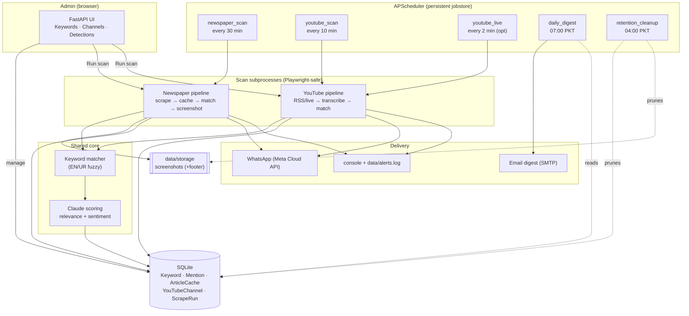

# Architecture

Media Monitoring watches Pakistani newspapers and YouTube channels for keywords,
captures evidence (screenshots / transcripts + deep-links), scores relevance and
sentiment, sends real-time alerts, and emails a daily digest.

## System diagram

## Components

| Area | Path | Responsibility |
|------|------|----------------|
| Config | `config.py` | All settings from env (`pydantic-settings`); nothing hardcoded |
| Database | `app/db/` | SQLAlchemy models + engine (SQLite, Postgres-ready) |
| Core | `app/core/keywords.py` | Exact + fuzzy (Levenshtein ≤ 2) matching, EN/UR normalization |
| Core | `app/core/scoring.py` | Claude relevance/sentiment (config-gated) |
| Newspaper | `app/scrapers/` | `base` (Playwright + robots + screenshots + footer), `dawn`, `configurable` + `sites.py` registry |
| Newspaper | `app/newspaper/` | `pipeline` (scrape→cache→match→screenshot→store→alert), `scan_manager` (subprocess runner) |
| YouTube | `app/youtube/` | `rss` (upload detect), `livestream` (live detect + tap), `transcribe` (stub/openai/local), `pipeline`, `scan_runner` |
| Notifiers | `app/notifiers/` | `console`, `whatsapp` (dry-run without creds), `MultiNotifier` |
| Digest | `app/digest/` | 24h HTML digest builder + SMTP sender (file fallback) |
| Maintenance | `app/maintenance/retention.py` | Prune screenshots/transcripts/logs past retention |
| Scheduler | `app/scheduler.py` | APScheduler jobs, persistent jobstore (resume after restart) |
| Web app | `app/main.py` | FastAPI admin UI + JSON API + scheduler lifecycle |
| Scripts | `scripts/` | CLI entry points (also what the subprocess runners invoke) |

## Key design decisions (diverge from the original brief — intentional, for a local Windows build)

| Brief recommended | Built | Why | How to switch later |
|---|---|---|---|
| Docker | none (local) | requested "no Docker" | add Dockerfile/compose |
| PostgreSQL + pgvector | SQLite (SQLAlchemy) | zero-setup on Windows | change `DATABASE_URL` + Alembic migration |
| Celery + Redis | APScheduler | Celery unsupported on Windows; no broker | move `scripts/run_*` into Celery tasks |
| AWS SES | SMTP | universal (Gmail/SES-SMTP/etc.) | keep SMTP or swap to SES SDK |
| AWS S3 / R2 | local `data/storage` | no cloud dep locally | add an S3 upload step in `capture_screenshots` |
| React + Tailwind | server-rendered HTML | fewer moving parts for MVP | build SPA against the existing JSON API |

**Why scans run as subprocesses:** Playwright's sync API is unstable inside the
async web server / scheduler threads (browser closes mid-scan). Each scan runs
as a detached subprocess (`scripts/run_scan.py`, `scripts/run_youtube.py`) where
Playwright is on a process main thread. SQLite runs in WAL mode so the web
process reads while a scan process writes.

## Data flow (newspaper)

1. Scheduler (or admin "Run scan") launches `scripts/run_scan.py` as a subprocess.
2. Each site's scraper renders listing pages via headless Chromium, extracts article links.
3. Unseen article bodies are fetched (bounded per scan) and cached in `ArticleCache`.
4. Active keywords are matched against title + cached body (fuzzy, EN/UR).
5. On a hit: full-page + cropped screenshots captured, metadata footer stamped, saved to `data/storage/<site>/`.
6. A `Mention` row is written (deduped by `module`+`external_id`); optional Claude scoring adds relevance/sentiment.
7. Alert fired to console/`alerts.log` and (if configured) WhatsApp.

YouTube is the same shape: RSS gives new uploads (title/description; + transcript
when a transcriber is enabled), matched keywords produce Mentions with a
`youtube.com/watch?v=…&t={sec}s` deep-link.

## Environment variable reference

Copy `.env.example` → `.env`. Everything runs in a safe default mode with no
credentials; each credential unlocks one live feature.

| Variable | Default | Purpose |
|---|---|---|
| `APP_ENV`, `LOG_LEVEL`, `TIMEZONE` | development / INFO / Asia/Karachi | core |
| `SCHEDULER_ENABLED` | true | set false to run the web UI without background scans |
| `DATABASE_URL` | `sqlite:///./data/media_monitoring.db` | DB connection (Postgres-ready) |
| `STORAGE_DIR` | `./data/storage` | where screenshots are written |
| `NEWSPAPER_SCRAPE_INTERVAL_MINUTES` | 30 | newspaper scan cadence |
| `NEWSPAPER_MAX_ARTICLES_PER_SCAN` | 20 | max **new** article bodies fetched per site per scan |
| `RESPECT_ROBOTS_TXT` | true | honour robots.txt; admin alert on block |
| `NEWSPAPER_SITES` | (all) | comma-separated slugs to limit which sites run |
| `YOUTUBE_SCAN_INTERVAL_MINUTES` | 10 | upload-scan cadence |
| `YOUTUBE_MAX_VIDEOS_PER_SCAN` | 15 | per-channel videos considered per scan |
| `YOUTUBE_TRANSCRIBER` | stub | `stub` \| `openai` \| `local` |
| `OPENAI_API_KEY` | — | Whisper API (when transcriber=openai) |
| `WHISPER_MODEL` | large-v3 | local faster-whisper model |
| `YOUTUBE_LIVE_ENABLED` | false | enable live-stream tapping (needs ffmpeg + transcriber) |
| `YOUTUBE_LIVE_CHUNK_SECONDS` | 30 | live audio chunk length |
| `YOUTUBE_LIVE_CHECK_INTERVAL_MINUTES` | 2 | live-check cadence |
| `ENABLE_LLM_SCORING` | false | turn on Claude relevance/sentiment |
| `ANTHROPIC_API_KEY` | — | Claude API key |
| `LLM_MODEL` | claude-sonnet-5 | scoring model (claude-haiku-4-5 is cheapest) |
| `NOTIFIER` | console | `console` \| `whatsapp` |
| `WHATSAPP_PHONE_NUMBER_ID`, `WHATSAPP_ACCESS_TOKEN`, `WHATSAPP_RECIPIENT` | — | Meta Cloud API |
| `SMTP_HOST`, `SMTP_PORT`, `SMTP_USER`, `SMTP_PASSWORD`, `SMTP_USE_TLS` | — / 587 / — / — / true | email transport |
| `DIGEST_SENDER`, `DIGEST_RECIPIENTS`, `DIGEST_HOUR_PKT` | — / — / 7 | digest addressing + time |
| `RETENTION_SCREENSHOTS_DAYS` / `_TRANSCRIPTS_DAYS` / `_LOGS_DAYS` | 90 / 365 / 730 | retention windows |

## API

Interactive docs (OpenAPI): **`http://127.0.0.1:8000/docs`**. Key endpoints:

| Method | Path | Purpose |
|---|---|---|
| GET | `/api/keywords` | list keywords |
| POST | `/api/keywords?text=&language=` | add keyword |
| PATCH/DELETE | `/api/keywords/{id}` | toggle active / delete |
| GET | `/api/channels` | list YouTube channels |
| GET | `/api/mentions?keyword=&limit=` | list detections |
| GET | `/api/scan/status`, `/api/scan/youtube/status` | live scan state |
| POST | `/api/scan/newspaper`, `/api/scan/youtube` | trigger scans |
